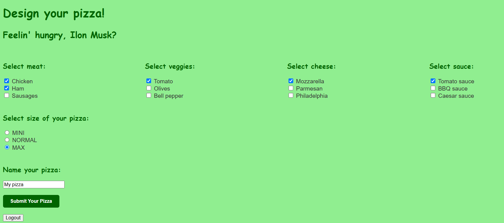

# Pizza Delivery App

## Overview
This is a Spring Boot-based web application for ordering custom pizzas. Users can register, design their own pizzas, place orders, and administrators can manage users, ingredients, and orders.

## Features
- User authentication and registration (roles: `USER`, `ADMIN`).
- Pizza customization: users can select ingredients and size.
- Order management: users can place and view orders.
- Admin panel:
    - Manage ingredients (add, delete).
    - Manage users (view, delete).
    - Manage orders (view, delete).
- Database support:
    - H2 (default for development).
    - PostgreSQL (for production).
- Docker support:
    - `Dockerfile` for containerization.
    - `docker-compose.yaml` for running the app with PostgreSQL.

## Technologies Used
- **Java 17**
- **Spring Boot 3.4.1**
- **Thymeleaf** for frontend templates
- **Spring Security** for authentication
- **Spring Data JPA** for database interactions
- **H2/PostgreSQL** databases
- **Maven** for dependency management
- **Docker** for containerization

## Setup Instructions
### Running Locally
1. Clone the repository:
   ```sh
   git clone https://github.com/yermaalexx/Pizza-delivery.git
   cd pizza-delivery
   ```
2. Configure environment variables in `.env` (optional for PostgreSQL setup).
3. Run the application:
   ```sh
   mvn spring-boot:run
   ```
4. Access the application at `http://localhost:8080`

### Running with Docker
1. Build and run using Docker Compose:
   ```sh
   docker-compose up --build
   ```
2. The application will be available at `http://localhost:8080`

## Screenshots

### Home page


### Registration page
New users must register by providing their name, phone number, delivery address and password. 
The validation system will not allow registration if a user with the same name already exists, 
if any field is left empty, or if the password and its confirmation do not match.


### Login page


### Design Pizza page
The Design Pizza page allows users to choose ingredients, size, and a name for their pizza. 
To proceed, at least one ingredient must be selected, a size must be chosen, and the name must be at least three characters long.



### Order page
The Order page allows users to remove a pizza from the order, add a new pizza, and update the delivery address.


### Admin page
If a user enters the administrator's username and password when logging in, he will have the appropriate privileges 
and will be able to see a link to the admin page.


On the corresponding page, the administrator can delete and add ingredients, as well as delete users and orders.


## License
This project is licensed under the MIT License.

